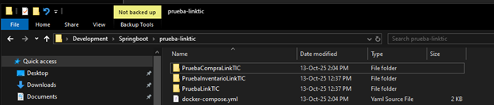
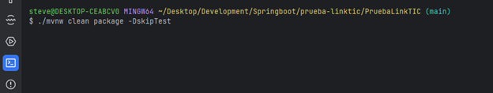
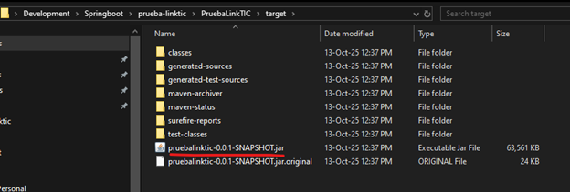
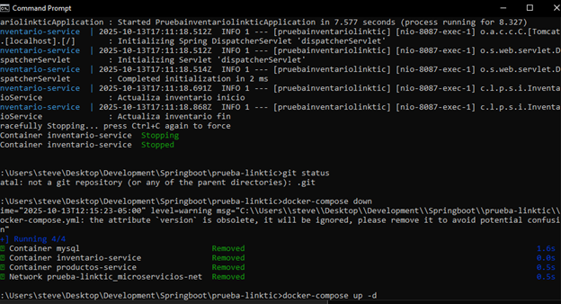
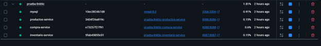
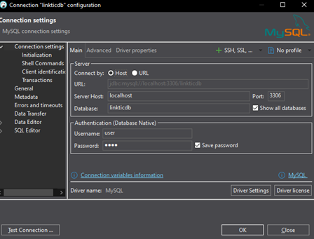
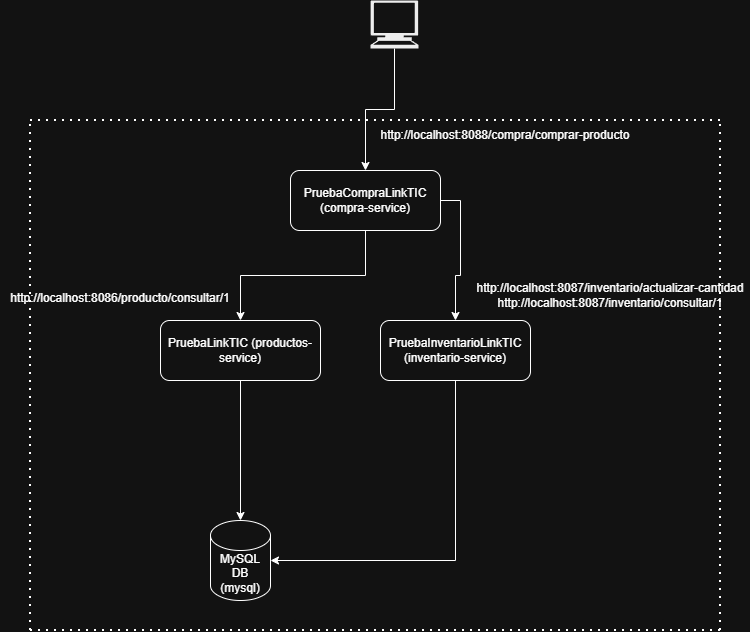
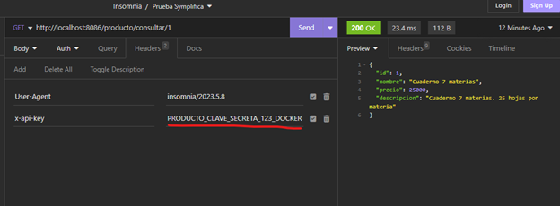
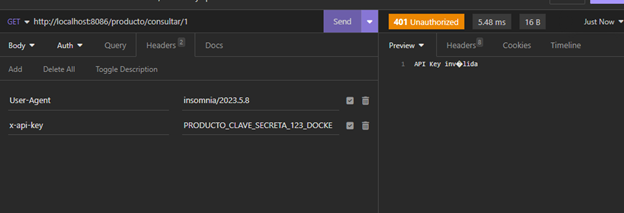

# 1. Despliegue

En una carpeta vacía ubicar el archivo docker-compose.yml (esta en la raiz de este proyecto) y en esa misma carpeta descargar los microservicios del repositorio:

- **https://github.com/stevenv17/PruebaLinkTIC.git** (microservicio productos)
- **https://github.com/stevenv17/PruebaInventarioLinkTIC.git** (microservicio inventario)
- **https://github.com/stevenv17/PruebaCompraLinkTIC.git** (microservicio compra)

 

Ubicarse en la raíz de cada uno de los microservicios y crear el archivo jar con el comando “**./mvnw clean package -DskipTest**” (Instalar Maven para este paso):

Después desde la ruta donde está ubicado el archivo docker-compose.yml ejecutar el comando “docker-compose up -d” para crear y subir los contenedores de los microservicios y la base de datos:

También se puede subir uno por uno los servicios (orden recomendado):

- **docker-compose up mysql -d**
- **docker-compose up productos-service -d**
- **docker-compose up inventario-service -d**
- **docker-compose up compra-service -d**

Conectarse a la DB de MySQL con las siguientes credenciales (password: pass):

 
Y ejecutar los scripts del archivo linktic_scripts-mysql.sql para crear las tablas.

### Acceso a Swagger:

- http://localhost:8086/swagger-ui/index.html (producto)
- http://localhost:8087/swagger-ui/index.html (inventario)
- http://localhost:8088/swagger-ui/index.html (compra)

# 2. Arquitectura:

# 3. Descripción:

Se creó un tercer microservicio (PruebaCompraLinkTIC) para el flujo de compra ya que los otros dos (producto e inventario) ya tenían las funcionalidades necesarias de consulta de producto, actualización de inventario y consulta de inventario.

El tercer microservicio cuenta con 2 Feign Client para hacer peticiones a los otros 2 contenedores.

Los microservicios de inventario y producto requieren autenticación con API_KEY a traves del header x-api-key:

En caso de que no sea correcto o no sé coloque el header, se obtendra una respuesta con status 401:

